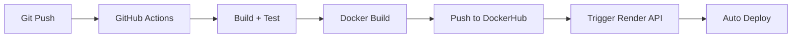
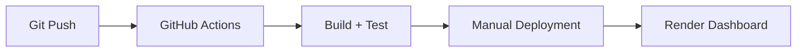

# 🔐 GUÍA DE SECRETS Y VARIABLES PARA DEMOMIXTO

## 📋 **SECRETS REQUERIDOS PARA CI/CD**

### **1. 🐳 DockerHub (OBLIGATORIO para Docker deployment)**
```
DOCKERHUB_USERNAME=tu_usuario_dockerhub
DOCKERHUB_TOKEN=tu_token_dockerhub
```

**¿Para qué?**
- Subir imágenes Docker automáticamente
- Render puede usar estas imágenes para deployment
- Registry público para distribución

**¿Cómo obtenerlos?**
1. Crear cuenta en hub.docker.com
2. Ir a Account Settings > Security > New Access Token
3. Crear token con permisos Read/Write

---

### **2. 🎯 Render (OPCIONAL - para API deployment)**
```
RENDER_API_KEY=tu_api_key_render
RENDER_SERVICE_ID=tu_service_id_render
```

**¿Para qué?**
- Trigger deployment automático via API
- Sin esto, debes hacer deployment manual desde Render dashboard

**¿Cómo obtenerlos?**
1. Render Dashboard > Account Settings > API Keys
2. Service ID desde la URL de tu servicio: `https://dashboard.render.com/web/srv-XXXXXXXXX`

---

### **3. 🚄 Railway (BACKUP - solo si quieres mantener opción)**
```
RAILWAY_TOKEN=tu_token_railway
RAILWAY_SERVICE_ID=tu_service_id
```

**¿Para qué?**
- Backup deployment automático con `[deploy-railway]` en commit
- Mantener Railway como opción sin costo adicional

---

## 🎯 **CONFIGURACIÓN PASO A PASO**

### **Paso 1: Configurar DockerHub (CRÍTICO)**

1. **Crear cuenta DockerHub:**
   ```bash
   # Ir a: https://hub.docker.com
   # Crear cuenta gratuita
   ```

2. **Crear Access Token:**
   ```
   DockerHub > Account Settings > Security > New Access Token
   Name: github-actions-demomixto
   Permissions: Read, Write, Delete
   ```

3. **Agregar a GitHub Secrets:**
   ```
   GitHub Repo > Settings > Secrets and variables > Actions > New repository secret
   
   Name: DOCKERHUB_USERNAME
   Secret: tu_usuario_dockerhub
   
   Name: DOCKERHUB_TOKEN  
   Secret: dckr_pat_XXXXXXXXXXXXXXXXXXXXX
   ```

### **Paso 2: Configurar Render (OPCIONAL)**

**Opción A: Deployment automático via API**
```
Render Dashboard > Account Settings > API Keys > Create API Key
GitHub Secret: RENDER_API_KEY=rnd_XXXXXXXXXXXXXXXX
```

**Opción B: Deployment manual (MÁS FÁCIL)**
- No configurar secrets
- CI/CD sube imagen a DockerHub
- Render detecta cambios y redeploya automáticamente

---

## 🚀 **IMPLICACIONES EN DEPLOYMENT**

### **CON SECRETS configurados:**


**Ventajas:**
- ✅ Deployment completamente automático
- ✅ Zero-downtime deployment
- ✅ Rollback automático en caso de fallo

### **SIN SECRETS (deployment manual):**


**Limitaciones:**
- ⚠️ Requires manual intervention
- ⚠️ Potential for human error
- ⚠️ Slower deployment cycle

---

## 🔧 **CONFIGURACIÓN MÍNIMA RECOMENDADA**

Para tu caso específico con Render funcionando:

### **NIVEL 1: Básico (Solo testing automático)**
```yaml
# No se requieren secrets
# CI/CD solo ejecuta tests
# Deployment manual desde Render
```

### **NIVEL 2: Docker Automation (RECOMENDADO)**
```yaml
DOCKERHUB_USERNAME=frantasticodev
DOCKERHUB_TOKEN=dckr_pat_XXXXX
# CI/CD builds + pushes Docker image
# Render auto-deploys when image updates
```

### **NIVEL 3: Full Automation**
```yaml
DOCKERHUB_USERNAME=frantasticodev
DOCKERHUB_TOKEN=dckr_pat_XXXXX
RENDER_API_KEY=rnd_XXXXX
RENDER_SERVICE_ID=srv-XXXXX
# Everything automated
```

---

## 📋 **CHECKLIST DE CONFIGURACIÓN**

- [ ] **DockerHub account created**
- [ ] **DockerHub token generated**
- [ ] **GitHub secrets configured**
- [ ] **Render service connected to GitHub repo**
- [ ] **Render dockerfile deployment enabled**
- [ ] **Environment variables configured in Render**

---

## 🚨 **TROUBLESHOOTING COMÚN**

### **Error: Docker login failed**
```bash
Causa: DOCKERHUB_TOKEN incorrecto o expirado
Solución: Regenerar token en DockerHub
```

### **Error: Render deployment failed**
```bash
Causa: Missing environment variables in Render
Solución: Configurar DB connections en Render dashboard
```

### **Error: Railway deployment triggered accidentally**  
```bash
Causa: Commit message contains '[deploy-railway]'
Solución: Railway deploy es manual, solo se activa con flag específico
```